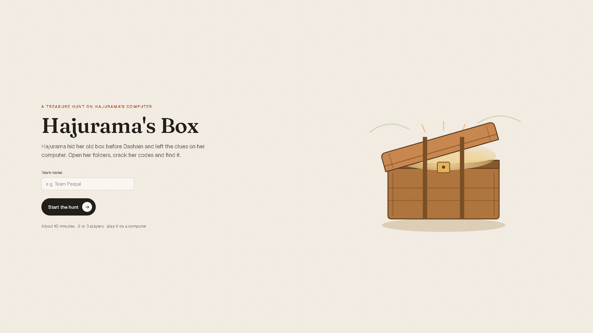
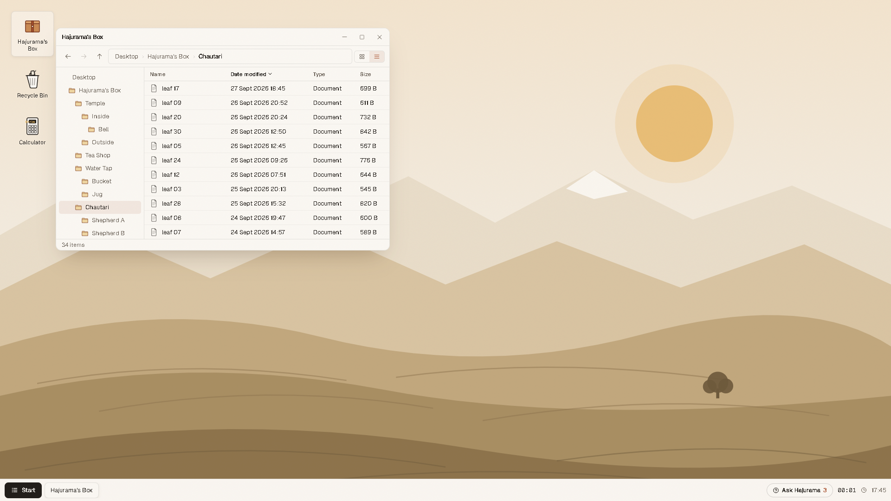
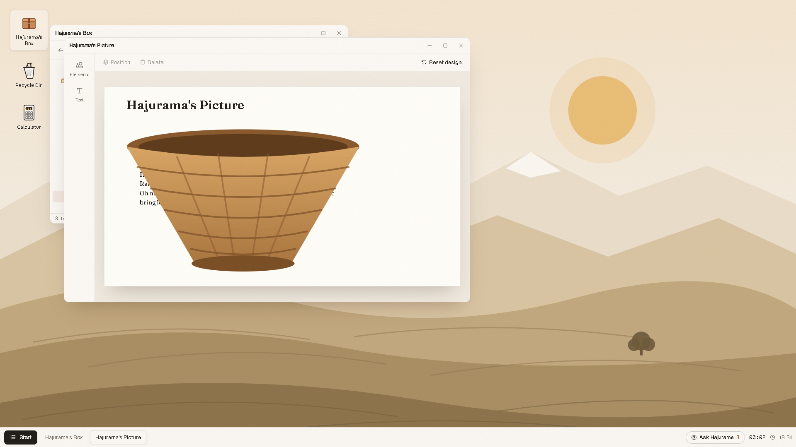
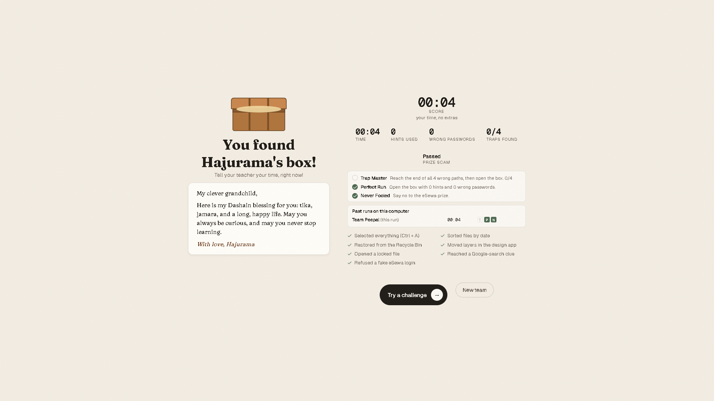

# Hajurama's Box

A treasure hunt that teaches real computer skills. Players get a pretend computer right inside the browser. They use Word, File Explorer, a design app, the Calculator, the Recycle Bin and Google search to find their grandmother's hidden box.

**Play it here: https://dantwoashim.github.io/escape/**

Open the link in Chrome, type a team name and press **Start the hunt**. It plays best on a laptop or desktop with a mouse.



## The story

Hajurama hid her old wooden box somewhere in the village before Dashain. She left a letter, a few folders and a trail of clues on her computer. Follow the clues, open the box and read her blessing.


## What players learn

- Finding hidden writing with Select All (Ctrl + A)
- Zooming in and changing font size and colour
- Find and Replace (Ctrl + H)
- Opening files that need a password
- Sorting files by date in File Explorer
- Checking a file's details with right-click and Properties
- Moving pictures and changing layers in a design app
- Restoring a deleted file from the Recycle Bin
- Searching on Google
- Using the Calculator
- Reading a secret code (a Caesar cipher)
- Spotting scams that ask for a PIN, OTP or eSewa password



## How the game works

The village has one right path and four wrong ones. Each wrong path looks promising for a few steps, so careful reading pays off. Every wrong path still teaches a skill before it sends the team back. Stay alert right up to the very end.

Each team gets three hints. Press **Ask Hajurama** in the taskbar whenever you feel stuck. The game saves as you play, so a page refresh picks up right where you left off. At the end you get a score: your time, plus 1 minute for every hint and 30 seconds for every wrong password.

Finished early? Press **Try a challenge** on the last screen. Trap Master asks you to reach the end of all four wrong paths. Perfect Run asks for zero hints and zero wrong passwords. Every run stays on that computer, so teams can compare scores.



## For teachers

Add `#teacher` to the end of the link, or press **Ctrl + Alt + H** during a game. The teacher panel shows every answer, the team's current step, and buttons to give an extra hint or start over. Keep this one to yourself!

A few tips for class:

- Put a big timer on the projector and let teams race.
- Play the whole game once yourself before class.
- Afterwards, talk through each skill the students used. The tea shop trap is a great way to start a chat about phone scams.



## Change the puzzles

Every word, clue, password and hint lives in one file: `src/game/content.ts`. Edit it and the game follows.

## Run it on your own computer

You need [Node.js](https://nodejs.org) 20 or newer.

```bash
npm install
npm run dev
```

Then open the address it prints, usually http://localhost:5173.

| Command | What it does |
| --- | --- |
| `npm run dev` | Starts a local copy that reloads as you edit |
| `npm run build` | Checks the code and builds the site into `dist/` |
| `npm run preview` | Serves the built site |
| `npm test` | Runs the unit tests |
| `npm run e2e` | Plays the whole game in Chrome with Playwright |

Every push to `main` publishes the site to GitHub Pages automatically.

## Built with

React, TypeScript and Vite. Icons from Phosphor. Fonts: Geist and Fraunces.
